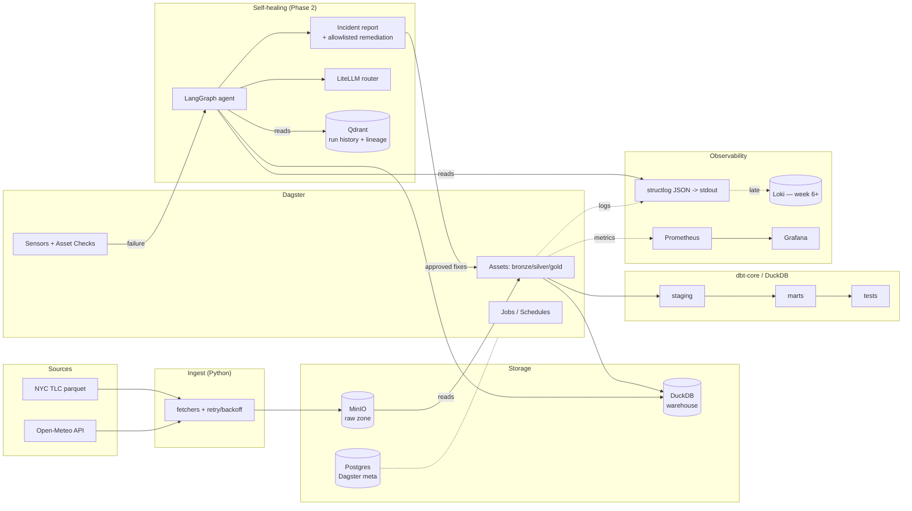

# Architecture

> First draft. Rewrite the prose in your own voice before committing — the
> diagrams and decision content are mine, the phrasing is mostly mine too, but
> these docs are the part reviewers read closest.

## Component diagram

The interesting edge is `S -- failure --> LG`. A Dagster sensor watches for
failed materializations and asset-check failures, packages the relevant context
(failed asset key, last N log lines, upstream lineage, recent run hashes), and
hands it to the agent. The agent's output is either a structured incident or
a remediation action drawn from a tight allowlist.

## ADRs

Format is loose. Each one says what I picked, what I rejected, and what
breaks. If a decision changes later, I update the ADR in place and add a
"Revised" note rather than spawning a new file. Real repos accrete revisions.

---

### ADR-001: Dagster over Airflow

**Decision:** Dagster.

**Context:** I need to orchestrate ingest, transform, and quality checks, and
I want the orchestrator's data model to support the agent. The agent needs to
ask "what is this asset, what feeds it, what depends on it, and what's its
recent run history" — not "what tasks ran in DAG X."

**Rejected:**

- **Airflow.** Mature, ubiquitous, but task-centric. The asset graph has to be
  reconstructed externally (custom XComs or OpenLineage glue). Asset checks
  are not first-class. Sensors are awkward for "watch any failure."
- **Prefect.** Closer to Dagster's model, but the asset graph is still less
  central, and the OSS story for sensors-on-failure is thinner.
- **Plain cron + Python.** Tempting for a portfolio, but I lose the lineage
  that the agent needs as input.

**Tradeoffs:**

- Dagster's metadata DB (Postgres in our setup) is one more thing to run.
- Smaller community than Airflow — fewer Stack Overflow answers.
- Dagster's terminology (assets, ops, jobs, resources, IO managers) is its own
  thing to learn. A new contributor would pay onboarding cost.

---

### ADR-002: DuckDB + dbt for the warehouse

**Decision:** DuckDB as the warehouse engine, dbt-core with `dbt-duckdb` as
the transform layer.

**Context:** Local-only, zero cloud spend, but the surface should mirror what
I'd use at a real company.

**Rejected:**

- **Postgres + dbt-postgres.** Works, but DuckDB is faster on analytic
  workloads, reads Parquet from MinIO directly, and the columnar format
  matches what a real warehouse looks like.
- **Polars + raw SQL files.** Loses dbt's lineage, tests, and docs. Those are
  exactly the inputs the agent needs.
- **MotherDuck.** Cloud-hosted DuckDB. Cool, but breaks "everything local."

**Tradeoffs:**

- DuckDB is single-writer. Concurrent writes from Dagster + dbt need
  ordering. Our IO manager serializes.
- The DuckDB file is on local disk — restarting MinIO does not lose data,
  restarting the container with a bad volume mount does. Mount it explicitly.
- Reviewers who only know Snowflake will need a paragraph on why DuckDB is a
  legitimate stand-in.

---

### ADR-003: dbt tests over Great Expectations

**Decision:** dbt tests as the primary DQ mechanism. `dbt-utils` and
`dbt-expectations` cover almost everything we'd otherwise get from GE.
Dagster asset checks fill the pre-warehouse gap.

**Context:** I evaluated GE seriously. The conclusion is that running two
DQ frameworks in one repo is a tax I don't want to pay for marginal coverage.

**Rejected:**

- **Great Expectations.** Strong profiler and Data Docs, but: separate runner,
  separate config, expectation suites that drift from model definitions, and
  a heavy install. Most "GE wins" I could point to (distributions, mostly-
  unique, value-set drift) are available via `dbt-expectations`.
- **Soda Core.** Closer in spirit to dbt tests, but adds another YAML dialect
  and another CLI. Not enough win for a portfolio.
- **Hand-rolled assertions in Python.** Fine for one-off checks. Loses the
  "tests live next to the model" property that makes dbt good.

**Tradeoffs:**

- We do not get GE's autoprofiler. If we ever need data profiling on raw
  sources, we'll add a one-off `pandas-profiling`/`ydata-profiling` script.
- `dbt-expectations` has rougher edges than vanilla dbt tests — some
  expectations are slow on large tables; pick carefully.
- We lose Data Docs as a polished artifact. dbt docs covers most of it.

---

### ADR-004: Auto-remediation is heavily constrained

**Decision:** The agent has a tight allowlist of remediation actions. Anything
outside it produces an incident report only.

**Allowlist (initial):**

1. **Retry-with-backoff** on transient ingest failures (HTTP 5xx, timeouts).
2. **Partition-window slip:** if the upstream source for date `D` is not yet
   available, slip to `D-1` and flag.
3. **Schema-drift coerce-to-string:** if a column's inferred type widens in
   bronze, coerce to string and route the row to a `_quarantine` table.
   Silver/gold never see it without human approval.

**Out of scope, always:**

- DDL changes to silver/gold.
- Backfills that span more than one day.
- Anything that deletes or truncates.
- Anything in production-only categories (we don't have prod, but the
  category exists for realism).

**Context:** The failure mode that kills "self-healing" projects is an agent
that confidently does the wrong thing and you can't undo it. Constraining the
action surface is the entire game.

**Rejected:**

- **Let the agent propose any SQL fix.** Tempting. Bad idea. The audit story
  is awful and reviewers will smell it immediately.
- **Approval-gated free-form fixes.** Considered. Adds UI complexity I don't
  want in Phase 2. Punted to Phase 3 if I ever do one.

**Tradeoffs:**

- The allowlist is small enough that the agent will often "fail to heal" and
  just file an incident. Good. That is the honest behavior.
- Each new allowlist action needs a unit test that exercises it against a
  recorded failure fixture. The fixtures take work to build.

---

### ADR-005: LiteLLM + provider abstraction; Groq as the default

**Decision:** All LLM calls go through LiteLLM with a project-internal client
wrapper. Groq's hosted Llama 3.3 70B is the default. Anthropic and OpenAI are
swappable via env var.

**Context:** Free dev iteration matters. Groq is fast and free up to a tier
that covers anything I'll do here. But I don't want the agent code coupled to
one provider's quirks.

**Rejected:**

- **Direct Anthropic SDK calls.** Locks us in; can't run free.
- **Ollama-only (local models).** Considered for fully-offline demos. Llama
  3.1 8B locally is too weak for the diagnostic prompts. Keep it as a
  fallback, not the default.
- **LangChain's model abstraction.** LangGraph already pulls some LangChain
  in; I'd rather have LiteLLM as a single explicit router and use LangGraph
  purely for orchestration.

**Tradeoffs:**

- LiteLLM is yet another dependency with its own surface area and occasional
  inconsistencies across providers (especially streaming + tool calling).
- Groq's free tier rate-limits aggressively. The agent has to handle 429s
  gracefully — fits the "self-healing" theme nicely, so this is actually a
  feature.
- Llama 3.3 70B is good but not Claude-good at structured reasoning. Prompts
  need to be more explicit than they'd need to be on Sonnet/Opus.

---

### ADR-006: Polars for in-process transforms

**Decision:** Use Polars where we touch DataFrames in Python (ingest cleanup,
schema validation pre-bronze). Pandas only where a dependency forces it.

**Context:** The dbt layer does most heavy lifting in SQL. But ingest needs to
parse, validate, and write Parquet. Polars is faster and the lazy API maps
well to "validate-then-materialize."

**Tradeoffs:**

- Slightly smaller ecosystem than Pandas. Some interop adapters needed.
- Team members who only know Pandas will need a day to ramp.
- Polars releases are still fairly frequent and occasionally break minor API
  surface. Pin versions and review on upgrade.

---

## Things deliberately not decided yet

- **CDC source for Redpanda.** Punted to week 7. Likely Debezium against the
  Postgres metadata DB so we have real CDC traffic to operate on, but I want
  to feel the shape of the agent first.
- **Vector store schema.** Qdrant is the choice; the schema (run-history
  chunks vs. asset-doc chunks vs. both) lands in week 8.
- **UI affordances.** Streamlit, but what panels? Decide after the agent's
  output shape stabilizes.

## Glossary

- **Medallion (bronze/silver/gold):** raw / cleaned / business-ready. Stolen
  from Databricks, used everywhere now.
- **Asset (Dagster):** a materialized data object with known dependencies,
  not a task. Closer to a make target than a cron job.
- **Asset check (Dagster):** a test that runs alongside an asset's
  materialization and fails the asset if it fails. Distinct from dbt tests,
  which run on rows in the warehouse.
